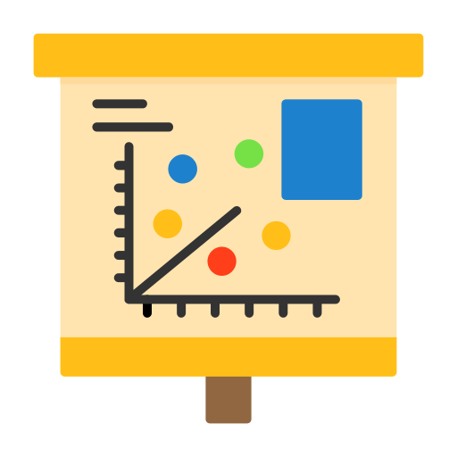
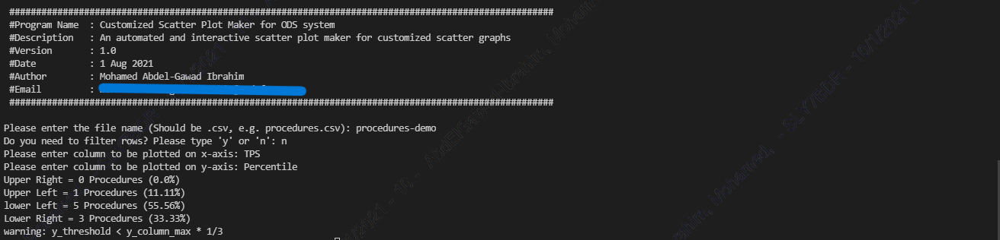
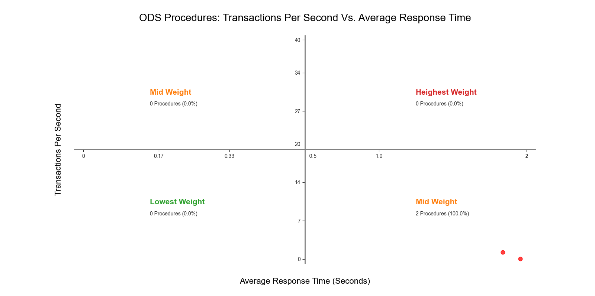
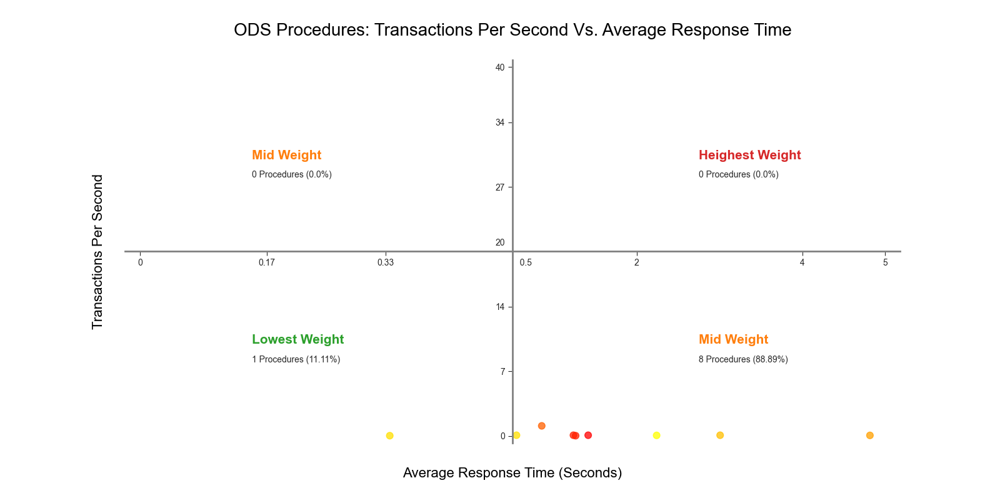
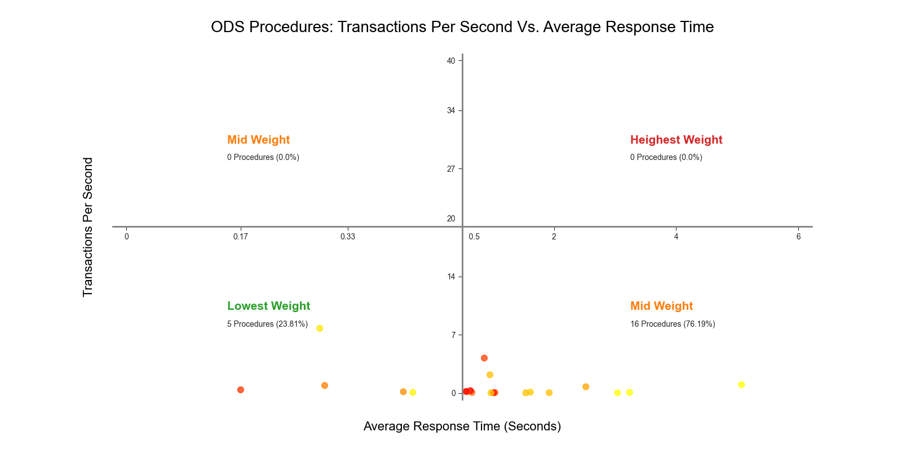
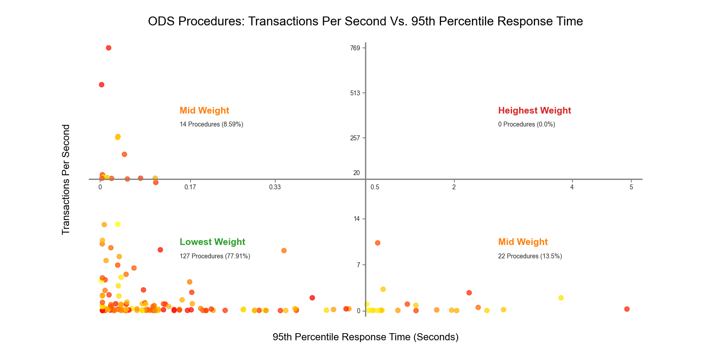
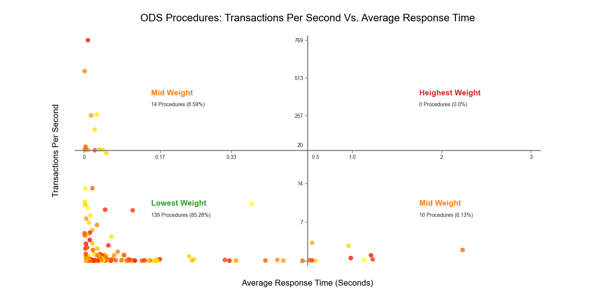

[![LinkedIn][linkedin-shield]][linkedin-url]

<!-- PROJECT LOGO -->
 

    
  <h3 align="center">Scatter Plot Tool for ODS System</h3>

<!-- TABLE OF CONTENTS -->

  
Table of Contents

  <ol>
    <li>
      <a href="#about-the-project">About The Project</a>
      <ul>
        <li><a href="#business-case">Business Case</a></li>
        <li><a href="#technical-solution">Technical Solution</a></li>
        <li><a href="#screenshots">Screenshots</a></li>
        <li><a href="#tech-stack">Tech Stack</a></li>
      </ul>
    </li>
    <li><a href="#contact">Contact</a></li>
  </ol>

<!-- ABOUT THE PROJECT -->
## About The Project

* **Project Name:** Scatter Plot Tool for ODS System  
* **Version:** v1.0.0  
* **Organization Department:** Technology

---

### Business Case

The ODS system requires customized data visualizations to analyze trends and patterns in system data. This project involves building a scatter plot tool that allows flexible visualization of ODS data, where users can filter specific rows, set custom thresholds, and dynamically scale the scatter plot for better insights. Previously, creating these kinds of visualizations manually was tedious and time-consuming.

With this tool, I automated the process of generating scatter plots, saving time and improving the ability to visualize data with customized thresholds.

(<a href="#readme-top">back to top</a>)

### Technical Solution

The scatter plot tool automatically generates customized scatter graphs based on user-defined thresholds for both axes. The tool splits the graph into four quadrants, determined by the x-threshold and y-threshold.

**Key Features:**
* **Automated and Interactive:** The tool automates the generation of scatter plots while allowing user interaction through threshold settings.
* **Filtering:** Users can filter specific rows of data to focus on particular subsets.
* **Threshold Customization:** Users can define the x-threshold and y-threshold to set the center of the figure.
* **Scaling:** Dots within the threshold range are true-scaled, while dots outside the thresholds are auto-scaled for better visual clarity.

(<a href="#readme-top">back to top</a>)

### Screenshots

(<a href="#readme-top">back to top</a>)

### Tech Stack

This project was developed using the following technologies:

* **Python** (Libraries: `pandas`, `numpy`, `matplotlib`)
* **VS Code** (Text Editor)
* **Git** (Version Control)

(<a href="#readme-top">back to top</a>)

<!-- CONTACT -->
## Contact

Mohamed AbdelGawad Ibrahim - [@m-abdelgawad](https://www.linkedin.com/in/m-abdelgawad/) - <a href="tel:+201069052620">+201069052620</a>

(<a href="#readme-top">back to top</a>)

<!-- MARKDOWN LINKS & IMAGES -->
[linkedin-shield]: https://img.shields.io/badge/-LinkedIn-black.svg?style=for-the-badge&logo=linkedin&colorB=555
[linkedin-url]: https://www.linkedin.com/in/m-abdelgawad/
